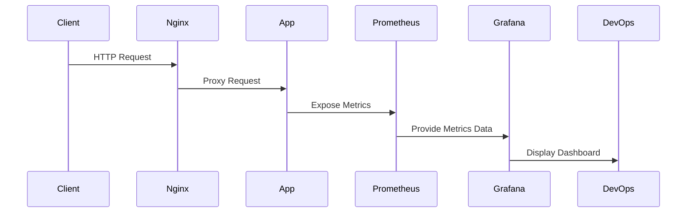

# 🐳 Docker-Based DevOps Monitoring System

### Prometheus • Grafana • Nginx • Node.js

<h3 align="center">Containerized Application Deployment with Observability Stack</h3>

---

<p align="center">


</p>

---

# 🌍 Project Summary

This project showcases how modern DevOps practices are used to deploy and monitor containerized applications in a production-like setup.

The system demonstrates a multi-container architecture where:

* A backend application runs inside Docker
* Nginx acts as a reverse proxy
* Prometheus collects application metrics
* Grafana visualizes monitoring data through dashboards

The goal is to simulate a real-world DevOps monitoring environment.

---

# 🎯 Key Learning Outcomes

* Containerization using Docker
* Managing multi-service architecture with Docker Compose
* Implementing monitoring and observability
* Configuring Prometheus for metrics scraping
* Building dashboards in Grafana
* Understanding production-style DevOps workflows

---

# 🏗️ System Architecture


---

# 🔁 Application Flow



---

# 📂 Directory Structure

```
docker-monitoring-system/
│
├── docker-compose.yml
│
├── backend/
│   ├── app.js
│   ├── package.json
│   └── Dockerfile
│
├── nginx/
│   └── nginx.conf
│
├── prometheus/
│   └── prometheus.yml
│
└── README.md
```

---

# 🛠️ Setup Instructions

## 1️⃣ Create Main Directory

```bash
mkdir docker-monitoring-system
cd docker-monitoring-system
```

## 2️⃣ Initialize Subdirectories

```bash
mkdir backend nginx prometheus
touch docker-compose.yml
```

---

## 3️⃣ Backend Configuration

```bash
cd backend
nano app.js
```

Add application source code.

Create dependencies file:

```bash
nano package.json
```

Create Docker configuration:

```bash
nano Dockerfile
```

---

## 4️⃣ Configure Nginx

```bash
cd ../nginx
nano nginx.conf
```

---

## 5️⃣ Configure Prometheus

```bash
cd ../prometheus
nano prometheus.yml
```

---

## 6️⃣ Define Docker Compose Services

```bash
cd ..
nano docker-compose.yml
```

---

# ▶️ Launch the System

```bash
docker compose up -d --build
```

---

# 🌐 Service Endpoints

| Service    | Access URL                                     |
| ---------- | ---------------------------------------------- |
| Web App    | [http://SERVER-IP](http://SERVER-IP)           |
| Prometheus | [http://SERVER-IP:9090](http://SERVER-IP:9090) |
| Grafana    | [http://SERVER-IP:3000](http://SERVER-IP:3000) |

Grafana Default Credentials:

```
Username: admin
Password: admin
```

---

# 📈 Sample Grafana Query

```
rate(http_requests_total[1m])
```

---

# 🧪 Simulate Traffic

```bash
for i in {1..200}; do curl http://localhost/api; done
```

---

# 👩‍💻 Author

**Samruddhi Pansare**
DevOps Enthusiast 🚀

LinkedIn: [https://www.linkedin.com/in/samruddhi-pansare-b34371328](https://www.linkedin.com/in/samruddhi-pansare-b34371328)
GitHub: [https://github.com/Samruddhipansare2211](https://github.com/Samruddhipansare2211)

---

<p align="center">

</p>

